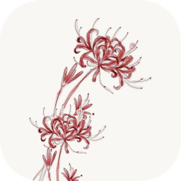
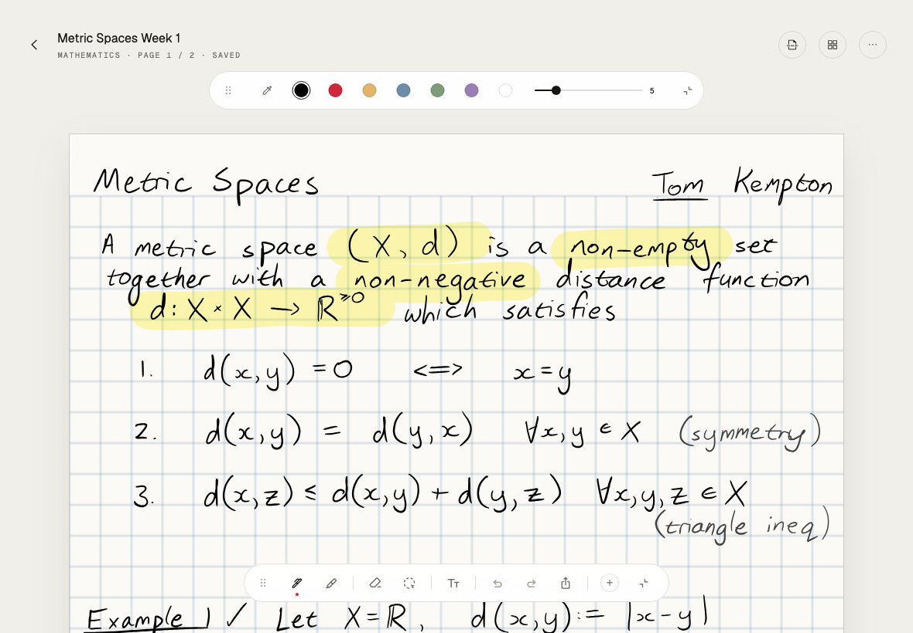
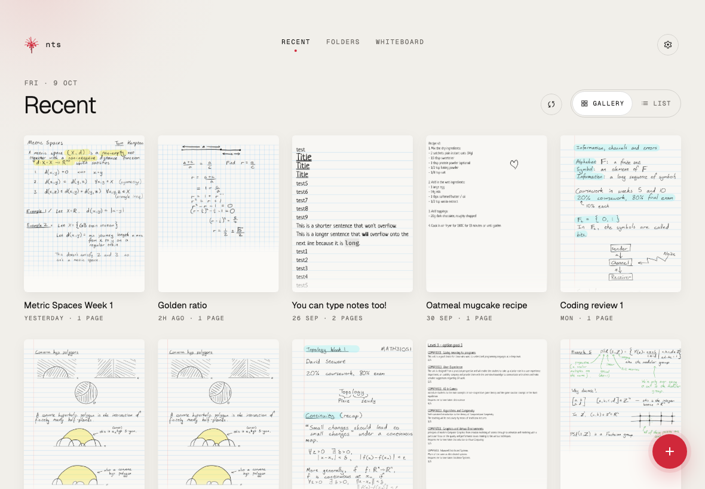
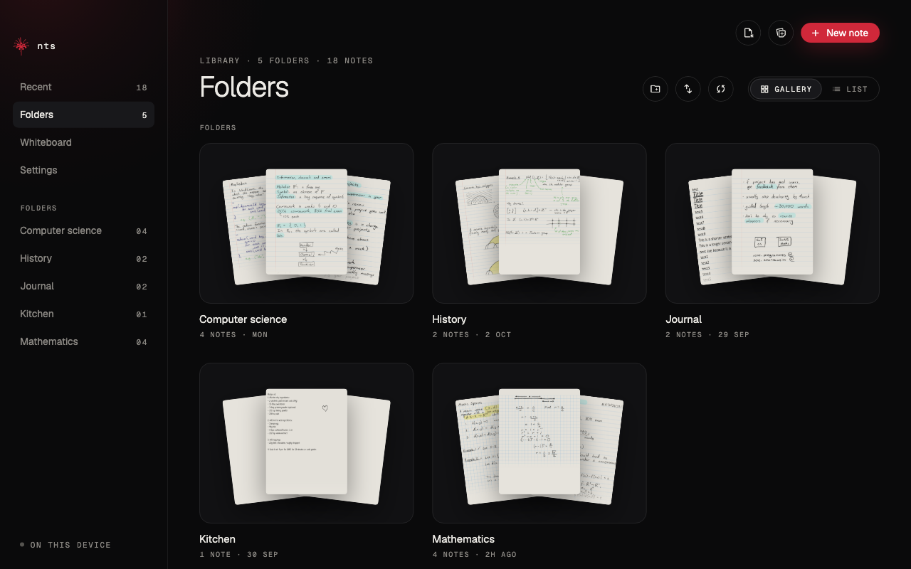
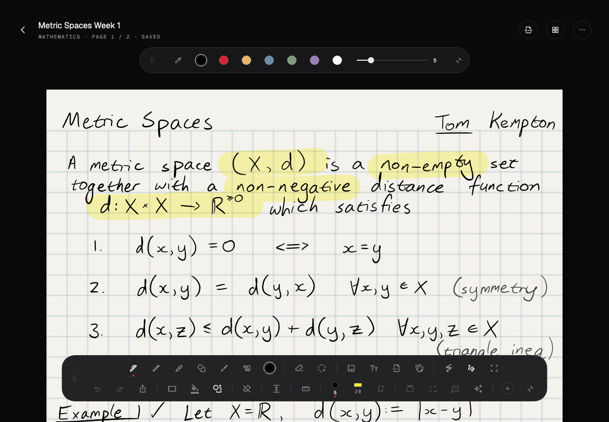

#  nts

nts is a handwriting notes app for iPad and Mac. You write with an Apple Pencil, a finger or a mouse. Notes are kept in your own iCloud Drive, and you can ask AI about anything you circle.

nts is a personal project. It isn't on the App Store, and it isn't affiliated with Saber or its authors. It's a modified version of [Saber](https://github.com/saber-notes/saber) (see [Credits and license](#credits-and-license)).



<p>
  
  
  
</p>

<sub>Screenshots are rendered by the app's snapshot tests (`HIGAN_SNAPSHOT=1`) using Saber's demo notes.</sub>

## Features

### Kinds of notes

- **Notebook.** Pages of paper, one after another, with lined, grid, dot, Cornell, music staff or blank backgrounds.
- **Whiteboard.** No paper and no pages: one large surface you can pan around in any direction. It uses the app's Night or Paper colours.
- **Endless page.** One long sheet with no page breaks. It keeps growing as you write near the bottom.
- **Slides.** Landscape 16:9 pages, for annotating lecture slides or drawing wide diagrams.
- **Flashcards.** Index cards, each with a front and a back. **Study** shows one card at a time: tap it to flip it, swipe for the next one, and shuffle the deck.

### Writing and drawing

- **Pens.** Fountain pen, ballpoint, pencil, brush pen, calligraphy pen and highlighter. Overlapping highlighter strokes never get darker. Ink stays smooth at every zoom level.
- **Hold to snap.** Draw a line, rectangle, square, circle, oval, triangle or star, then hold the pen still at the end. It turns into a clean shape, and you can see it before you lift. Turn this on or off in Settings › Writing.
- **Text boxes.** With the Text tool, tap anywhere to type. Drag a box by its grip with a finger or the Pencil, even while you're still typing. Drag its right edge to change the width, and pick its size and colour. On iPad you can also handwrite into a box with Scribble. Text typed in older versions becomes a text box automatically.
- **Eraser.** Erases whole strokes, or only the parts it passes over. Its outline follows the Pencil, a finger or the mouse, and updates as you change its size. You can also scribble over ink to erase it.
- **Lasso.** Select freehand or with a rectangle, then move, resize, rotate, recolour, copy, cut, paste, screenshot, add a link, or turn handwriting into text. Handwriting recognition runs on the device with Apple's Vision framework.
- **Study tools.** Tape that hides what's under it until you tap it, a ruler for straight lines, insert space, fill, and a laser pointer for presenting.

### The space beside the page

The empty space to the left and right of each page is usable too:

- **Images.** Drag a picture in from another app, such as Photos, Safari or Files beside nts on an iPad, or Finder on a Mac. It goes beside the page, on the side nearest where you drop it (on a whiteboard, right where you drop it). With the lasso tool, press an image and drag it anywhere: onto the page, out to either side, or back.
- **Move notes aside.** Lasso some ink and tap **Move beside the page** (left or right) to free up room on the page. The same buttons bring it back.
- **Readable cards.** Anything beside the page sits on a card in the page's colour, edged in red so it's clear what was moved there. If the ink would be hard to read on the page colour, the card switches to light or dark to keep it readable.
- **Writing there.** You can write, erase and lasso beside the page as well. Zoom out or scroll sideways to reach it.

### Organizing

- **Folders.** View them as a gallery or a list. Give each folder a muted colour and an icon, such as a spider lily, lotus, blossom, leaf or a subject. The colour and icon are saved inside the folder, so they sync with it.
- **iCloud Drive.** Choose a folder in iCloud Drive and use the same folder on your iPad and Mac. iCloud Drive does the syncing; there's no nts server or account.
- **PDFs.** Import a PDF to write on it, and export any note as a PDF or an image.

### Toolbar

- **Your tools.** Add, remove and reorder buttons from the **+** sheet, and save pen presets for the colours and sizes you use most.
- **Move it anywhere.** Drag the toolbar by its grip. Against the left or right edge of the screen it stands upright; anywhere else it lies flat. It also minimizes to a small circle.

### Ask AI

Circle part of a note and ask for an explanation with an example, a paragraph, a graph, an illustration, a video or web sources. Each answer can be added on the page, or beside it on the left or right.

AI uses accounts you sign in to in Settings › AI accounts:

- **ChatGPT**, with your ChatGPT plan
- **Claude**, through Claude Code installed on your Mac (Mac only)
- **Google** (Gemini and YouTube), through an OAuth client in your own Google Cloud project

Each provider's own terms apply to your account.

## Build and install

nts pins its own Flutter version as a git submodule in `submodules/flutter`. Always use `./submodules/flutter/bin/flutter`, not a Flutter you installed separately.

### What you need

- A Mac with [Xcode](https://apps.apple.com/app/xcode/id497799835). Open it once so it finishes installing its components.
- [Homebrew](https://brew.sh), then CocoaPods and Rust (one of nts's packages needs Rust):

  ```sh
  brew install cocoapods rustup
  export PATH="/opt/homebrew/opt/rustup/bin:$PATH"  # Homebrew's rustup isn't on PATH by default
  rustup default stable
  ```

### Get the code

```sh
git clone --recurse-submodules https://github.com/mehmetbisen17/nts nts
cd nts
./submodules/flutter/bin/flutter pub get
```

If you cloned without `--recurse-submodules`, run `git submodule update --init --recursive`.

### Mac

```sh
./submodules/flutter/bin/flutter build macos --release
open build/macos/Build/Products/Release/nts.app
```

Drag `nts.app` into Applications to keep it. The Mac build is signed to run locally, so it doesn't need an Apple ID.

### iPad

1. Open `ios/Runner.xcworkspace` in Xcode. In the **Runner** target, under **Signing & Capabilities**, choose your team. A free Apple ID works (add it in Xcode › Settings › Accounts). If Xcode says the bundle identifier is taken, change it to something unique, such as `com.yourname.nts`.
2. Connect the iPad with a cable, trust the Mac, and turn on **Developer Mode** (Settings › Privacy & Security).
3. Install a release build:

   ```sh
   ./submodules/flutter/bin/flutter devices          # find your iPad's name
   ./submodules/flutter/bin/flutter run --release -d "Your iPad"
   ```

   Press `q` once it has launched. The app stays installed.
4. The first time, trust your developer profile on the iPad in Settings › General › VPN & Device Management.

**Free Apple ID:** apps signed with a free account run for **7 days**. After that, nts won't open until you run step 3 again. Your notes live in iCloud Drive, so reinstalling doesn't touch them. A paid Apple Developer account extends this to a year.

### First launch

- **Settings › iCloud:** pick or create a folder in iCloud Drive, for example `nts`. Choose the same folder on every device.
- **Settings › AI accounts:** sign in to the AI providers you want to use.

## Development

```sh
export PATH="/opt/homebrew/opt/rustup/bin:$PWD/submodules/flutter/bin:$PATH"
flutter analyze
flutter test
```

Where things are:

| Folder | What's in it |
|---|---|
| `lib/pages/editor/` | The editor screen, and flashcard study |
| `lib/components/canvas/` | The page canvas: drawing, gestures, images, text boxes and the space beside pages |
| `lib/components/toolbar/` | The toolbar, the colour and size bar, and the lasso's actions |
| `lib/data/editor/` | The note model: pages, kinds of notes, text boxes, undo history and saving |
| `lib/data/tools/` | Pens, eraser, lasso and shapes |
| `lib/components/home/`, `lib/pages/home/` | The library, folders and settings |
| `lib/components/ai/`, `lib/data/ai/` | Ask AI and the AI accounts |
| `lib/data/icloud/` | Access to the iCloud Drive folder |
| `packages/sbn/` | Parts of the `.sbn2` note format |
| `test/` | Tests |

Notes are saved as `.sbn2` files (BSON), Saber's note format. nts writes format version 21, which adds kinds of notes and text boxes. Saber opens these files read-only.

## Privacy

Your notes stay on your devices and in your own iCloud Drive. nts has no analytics or crash reporting. AI features only send something when you tap an AI action, and only to the provider you chose. See the [privacy policy](privacy_policy.md).

## Credits and license

nts is a modified version of [Saber](https://github.com/saber-notes/saber), copyright © 2022–2026 Adil Hanney and contributors, which is free software under the GNU General Public License v3.0.

Changes made for nts in 2026 include:

- the Higan design, with Night and Paper themes;
- iCloud Drive storage in place of Nextcloud;
- the whiteboard, endless page, slides and flashcard note types;
- text boxes;
- the space beside pages;
- hold to snap shapes;
- folder colours and icons;
- the customizable, movable toolbar;
- new tools;
- Ask AI.

The original copyright notices are kept in the app and in this repository.

nts is distributed under the same license, the [GNU General Public License v3.0](LICENSE.md). You can use, study, change and share it under the terms of that license. It comes with no warranty.
